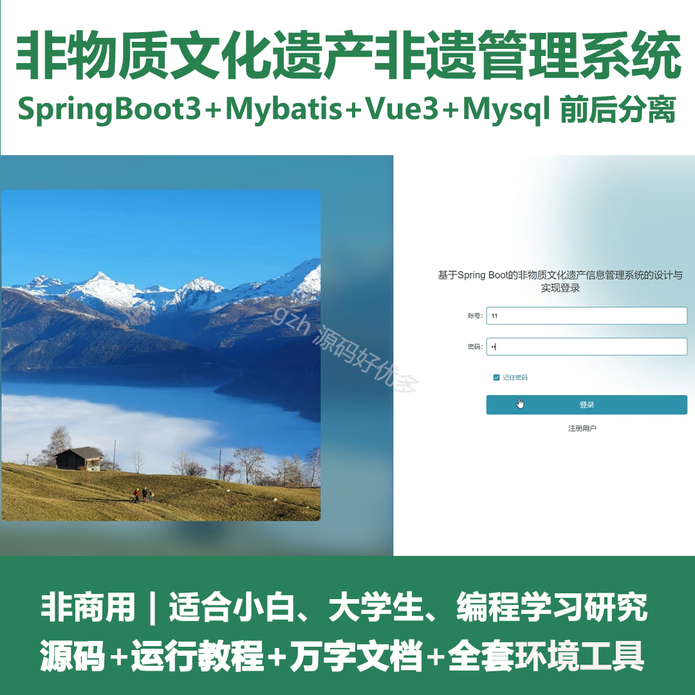
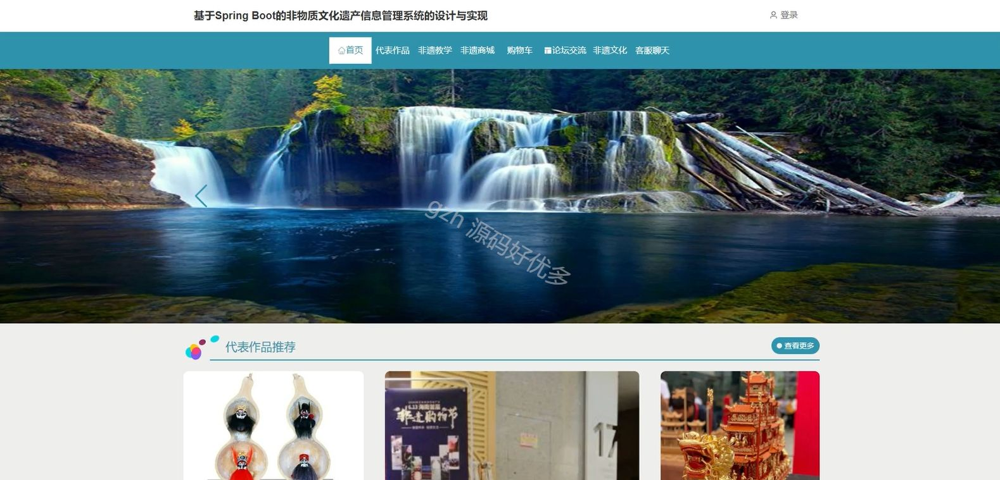
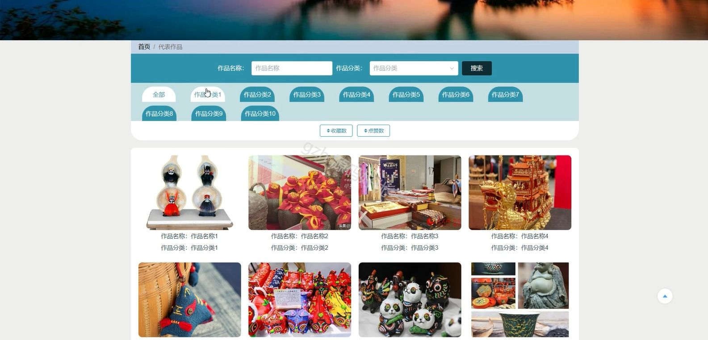
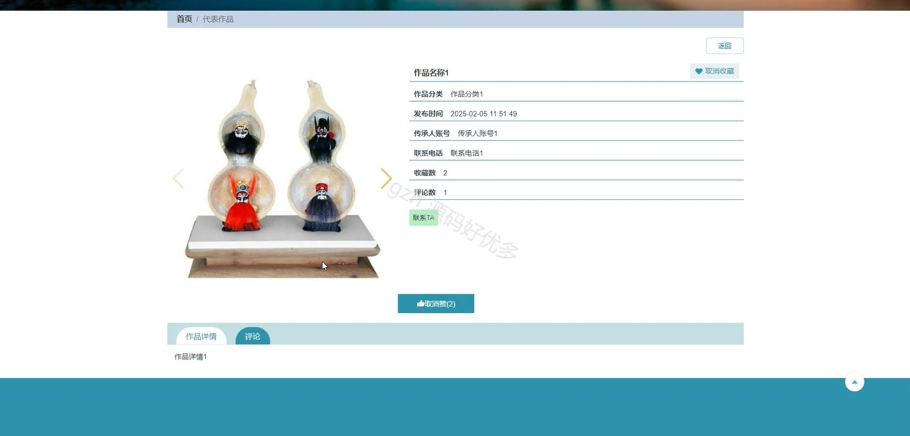
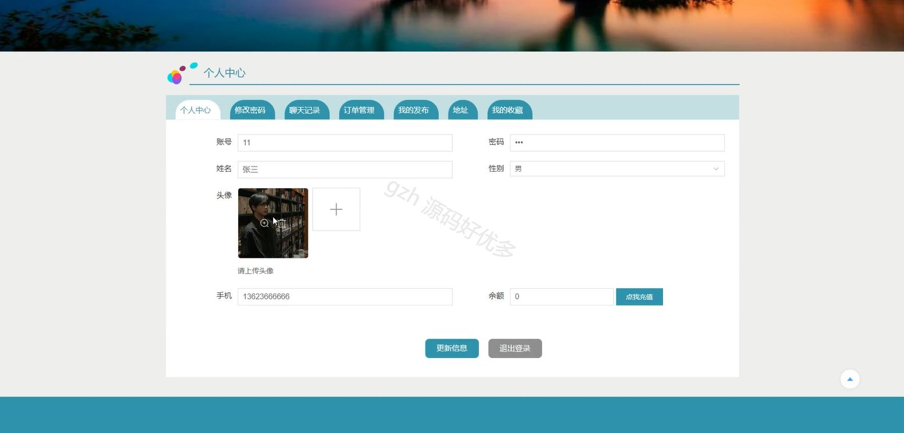
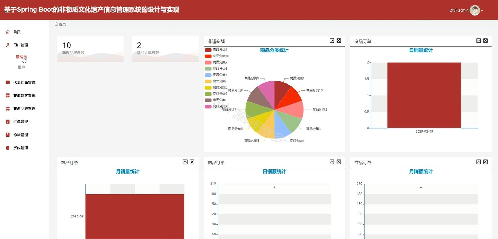
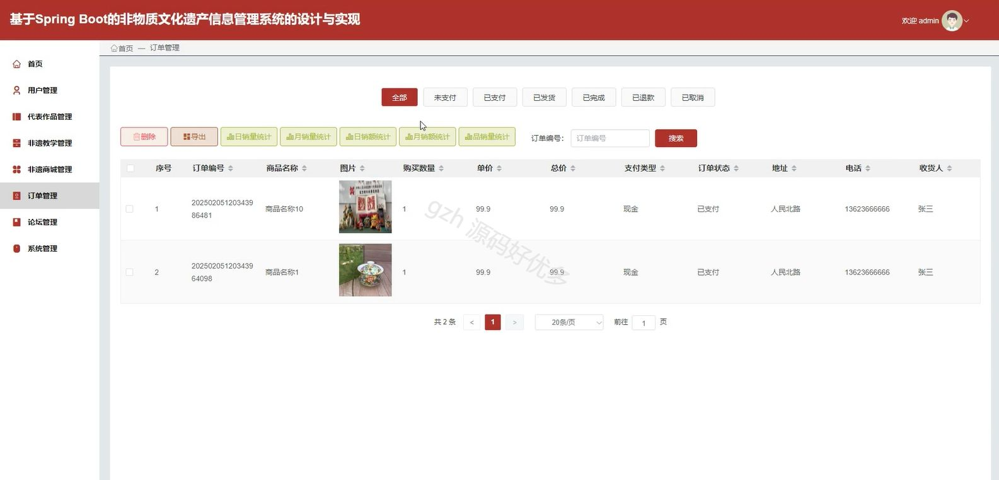
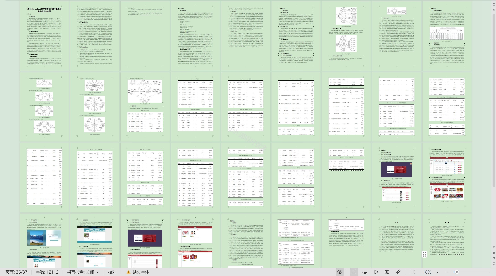

# springbootA388D
springbootA388D非物质文化遗产非遗管理系统
## 查看主页获取源码

### 一、关键词

非物质文化、非遗商城、非遗作品

 

### 二、作品包含

源码+数据库+设计文档万字+全套环境和工具资源+部署教程

 

### 三、项目技术

前端技术：Html、Css、Js、Vue3.0、Element-plus
后端技术：Java、SpringBoot3.0、MyBatis

  

 

### 四、运行环境（以下版本亲测，其他版本未知，请自测）

开发工具：IDEA/eclipse  + VSCODE

数据库：MySQL5.7（最低要5.7版本）

数据库管理工具：Navicat10以上版本

环境配置软件： jdk17 + Maven3.6.3

前端Nodejs：20

浏览器：谷歌浏览器

 

### 五、项目介绍

项目编号：springbootA388D

非物质文化遗产管理系统通过数字化手段对非遗信息进行整合、展示与管理，为非遗的保护、传承、传播以及相关产业发展提供支持。

角色：管理员、用户、传承人

管理员：首页、用户管理、代表作品管理、非遗教学管理、非遗商城管理、订单管理、论坛管理、系统管理。

用户：首页、代表作品、非遗教学、非遗商城、购物车、论坛交流、非遗文化、客服聊天、个人中心、修改密码、聊天记录、订单管理、我的发布、地址、我的收藏。

传承人：首页、代表作品管理、非遗教学管理、个人中心、聊天记录、修改密码。

 

### 六、运行截图

